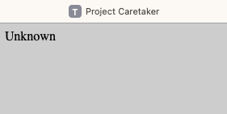
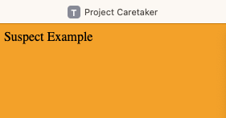
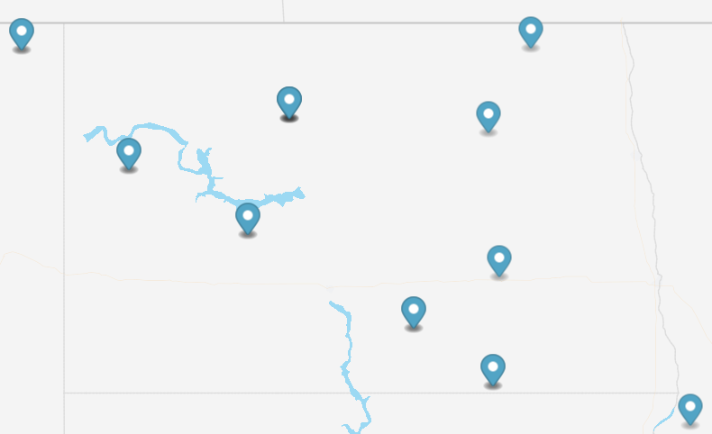

# caretaker

Reputation is the most critical asset available when using the Internet, as it helps us decide which services we feel safe using. It can also impact an end-users ability to use the web if the connection had previous suspect behavior. Project Caretaker aims to provide a Threat Feed for North Dakota so that anyone can verify Internet reputation.

Every Monday at 10 AM UTC, a.k.a. 5 AM CT, the Internet addresses for the Broadband Association of North Dakota (BAND) members, North Dakota Univesity System (NDUS), and the State of North Dakota (ITD) get updated from Security Trails, a Recorded Future company.

- https://bgpview.io
- https://broadbandnd.com
- https://ndit.nd.gov

### Autonomous System Numbers (ASN)

- 11138 - BEK Communications Cooperative
- 14090 - NORTH DAKOTA TELEPHONE COMPANY
- 14511 - POLAR-COMMUNICATIONS
- 14543 - SRT Communications, Inc.
- 18780 - Reservation Telephone Coop.
- 19530 - State of North Dakota, ITD
- 26794 - Dakota Carrier Network
- 27539 - West River Telecommunications Cooperative
- 29744 - United Telephone Mutual Aid Corporation
- 31758 - Griggs County Telephone Co.
- 32809 - Dickey Rural Networks
- 33339 - Nemont Telecommunications
- 36374 - Stellar Association, LLC
- 63414 - Dakota Central Telecommunications Cooperative

It results in **418,048** IPv4 addresses and ten /32 subnets of IPv6 addresses to monitor for reputation.

A /32 subnet of IPv6 has 65,536 /48 subnets, each with 65,536 /64 subnets with 18,446,744,073,709,551,616 addresses, making a vast number. IPv6 addresses get converted to integers to determine if they fall into any of the monitored ranges.

### Misconfiguration

Every day starting at 10:00 AM UTC, a.k.a. 5:00 AM CT, queries run against **Censys** for misconfigurations that expose insecure services to the Internet. 

Thank you to **Censys** for providing research access that makes this possible!

- https://search.censys.io

### Monitored Services

- ACTIVEMQ
- AMQP
- BACNET
- COAP
- COBALT_STRIKE
- CWMP
- DARKGATE
- DHCPDISCOVER
- DNP3
- ELASTICSEARCH
- EPMD
- ETHEREUM
- FOX
- FTP
- IMAP
- IPMI
- IPP
- KRPC
- KUBERNETES
- LDAP
- MEMCACHED
- MMS
- MODBUS
- MONERO_P2P
- MONGODB
- MQTT
- MSSQL
- MYSQL
- NETBIOS
- OPC_UA
- ORACLE
- PC_ANYWHERE
- POP3
- POSTGRES
- PPTP
- PROMETHEUS
- REDIS
- ROCKETMQ
- RDP
- RTSP
- S7
- SCCM
- SIP
- SKINNY
- SMB
- SNMP
- SSDP
- TEAM_VIEWER
- TELNET
- TFTP
- TPLINK_KASA
- UPNP
- VNC
- X11
- ZEROMQ

### Reputation

The following threat feeds pull once or twice an hour to determine if any addresses from North Dakota exist on the lists. 

If there are others that you would like added, please open an issue on the repository?

I appreciate all the work that goes into maintaining these lists - thank you!

- https://cinsscore.com
- https://feodotracker.abuse.ch
- https://github.com/stamparm
- https://jamesbrine.com.au
- https://osint.digitalside.it
- https://otx.alienvault.com
- https://report.cs.rutgers.edu
- https://securityscorecard.com
- https://www.binarydefense.com
- https://www.blocklist.de
- https://www.dan.me.uk
- https://www.nubi-network.com
- https://www.proofpoint.com
- https://www.rescure.me
- https://www.spamhaus.org

The complied threat feed that focuses on North Dakota gets updated every hour.

- https://feed.tundralabs.org

The critical part is making the results usable by anyone with just a website visit!

The lookup completes using the Internet address your connection originates from to protect the potential sensitivity of the returned results.

We don't want to tip the hand like playing cards, losing the advantage!

- https://verify.tundralabs.org

If the website returns **gray**, it means there is no data currently available, but that does not mean there still could not be a problem. 

When the website returns **orange**, it will explain why.

You may require additional assistance to resolve the issue outside of this project; at least the awareness to start asking questions will exist.

No threat feed is complete without a map to visualize the results using GeoLite2 data created by MaxMind within a general area for privacy.

- https://dev.maxmind.com/geoip/geolite2-free-geolocation-data
- https://map.tundralabs.org

This product includes GeoLite2 data created by MaxMind, available from https://www.maxmind.com.
