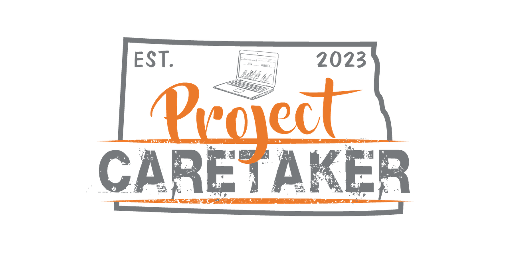
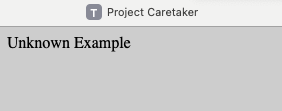
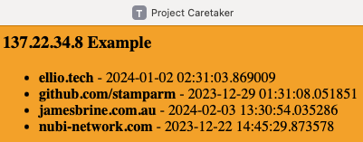
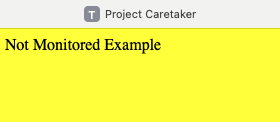
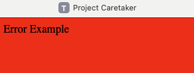
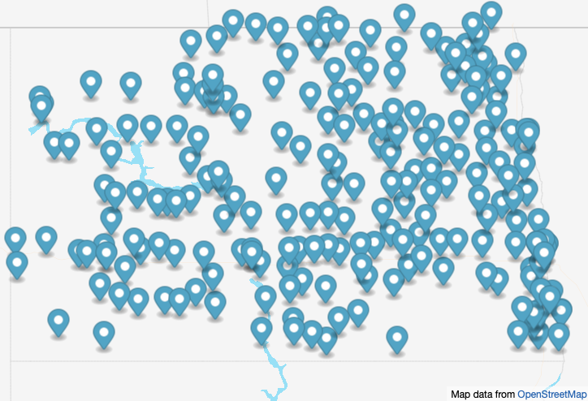
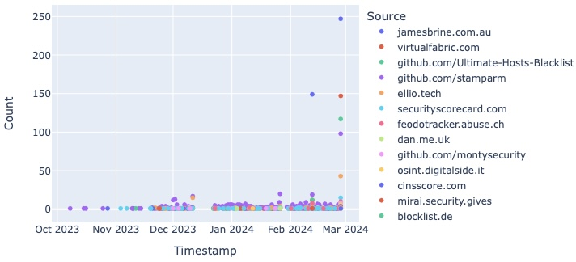

Reputation is the most critical asset available when using the Internet, as it helps us decide which services we feel safe using. It can also impact an end-users ability to use the web if the connection had previous suspect behavior. Project Caretaker aims to provide a Threat Feed for North Dakota so that anyone can verify Internet reputation.

Every Monday at 9:00 AM UTC, the Internet addresses for the Broadband Association of North Dakota (BAND) members, North Dakota Univesity System (NDUS), and the State of North Dakota (ITD) get updated from Security Trails, a Recorded Future company.

- https://bgpview.io
- https://broadbandnd.com
- https://ndit.nd.gov

I added additional Internet Service Providers (ISPs) to guarantee coverage of the state. :earth_americas:

### Autonomous System Numbers (ASN)
- 209 - CenturyLink Communications, LLC **++**
- 6167 - Verizon Business **+**
- 7018 - AT&T Services, Inc. **+**
- 11138 - BEK Communications Cooperative
- 11232 - Midcontinent Communications
- 11492 - Sparklight a.k.a. Cable One, Inc. **++**
- 12042 - Consolidated Communications, Inc.
- 14090 - North Dakota Telephone Company
- 14511 - Polar Communications
- 14543 - SRT Communications, Inc.
- 15267 - 702 Communications
- 18780 - Reservation Telephone Coop.
- 19530 - State of North Dakota, ITD
- 21730 - Halstad Telephone Company
- 21928 - T-Mobile USA, Inc. **+**
- 26794 - Dakota Carrier Network
- 27539 - West River Telecommunications Cooperative
- 29744 - United Telephone Mutual Aid Corporation
- 31758 - Griggs County Telephone Co.
- 32809 - Dickey Rural Networks
- 33339 - Nemont Telecommunications
- 36374 - Stellar Association, LLC
- 55105 - Northwest Communications Cooperative
- 63414 - Dakota Central Telecommunications Cooperative
- 400439 - Consolidated Telecommunications

It results in **16,852,992** IPv4 addresses and **33** IPv6 cidr allocations to monitor for reputation. 

A /32 subnet of IPv6 has 65,536 /48 subnets, each with 65,536 /64 subnets with 18,446,744,073,709,551,616 addresses, making a vast number. IPv6 addresses get converted to integers to determine if they fall into any of the monitored ranges.

**+** Location is limited to the state of North Dakota.

### Brand Monitoring

Every Monday at 9:00 AM UTC, queries run against **Censys** for certificates with the province of either **North Dakota** or the abbreviation **ND** to collect **28,246** domain names for ```apex``` and ```www``` brand monitoring.

Thank you to **Censys** for providing research access that makes this possible!

- https://search.censys.io

Certificate Transparency (CT) is a security standard for monitoring and auditing the issuance of digital certificates. Chrome, Firefox, Safari, etc., web browsers require certificates to be listed to be trusted when surfing the Internet.

- https://certificate.transparency.dev

The domain names from the certificates are normalized to guarantee valid top-level domains with wild cards removed.

- https://www.iana.org

Google Maps Platform is used to find Places by Category located within North Dakota to identify brands hosted in the cloud.

| Category | Count | Updated |
|:---:|:---:|:---:|
| church | 1,360 | Feb. 17th, 2024 |
| hotel | 360 | Feb. 9th, 2024 |
| restaurant | 1,120 | Feb. 16th, 2024 |
| school | 904 | Feb. 17th, 2024 |
| store | 3,206 | Feb. 17th, 2024 |

Collecting domains to monitor got expensive and would require significant maintenance, so I tried Apify for the initial categories.

- https://apify.com

### Email Security

Every Monday at 10:00 AM UTC, domains are checked for **MX** records to determine if an email server is present; once identified, verification of **DMARC** and **SPF** records occurs.

### Misconfiguration

Every day starting at 10:00 AM UTC, a.k.a. 5:00 AM CT, queries run against **Censys** for misconfigurations that expose insecure services to the Internet. 

Thanks again to **Censys** for providing research access that makes this possible!

- https://search.censys.io

**++** CenturyLink service area includes the following cities in North Dakota: Bismarck, Dickinson, Fargo, Grand Forks, Jamestown, and West Fargo.

**++** Sparklight service area is Fargo,ND only.

### Monitored Services

|     |     |     |     |
|:---:|:---:|:---:|:---:|
| ACTIVEMQ | AMQP | BACNET |COAP |
| COBALT_STRIKE | CWMP **+++** | DARKGATE | DCERPC |
| DHCPDISCOVER | DNP3 | ELASTICSEARCH | EPMD |
| ETHEREUM | FOX | FTP | IMAP |
| IPMI | IPP | KRPC | KUBERNETES |
| LDAP | MEMCACHED | MMS | MODBUS |
| MONERO_P2P | MONGODB | MQTT | MSSQL |
| MYSQL | NETBIOS | OPC_UA | ORACLE |
| PC_ANYWHERE | PCOM | POP3 | POSTGRES |
| PPTP | PROMETHEUS | REDIS | ROCKETMQ |
| RDP | RTSP | S7 | SCCM |
| SIP | SKINNY | SMB | SNMP **+++** |
| SSDP | TEAM_VIEWER | TELNET | TFTP |
| TPLINK_KASA | UPNP | VNC | X11 |
| ZEROMQ |

- https://search.censys.io/search/definitions

**+++** CWMP and SNMP prevalence required exclusion from Midcontinent results.

### Reputation

The following threat feeds pull once or twice an hour to determine if any addresses from North Dakota exist on the lists. 

If there are others that you would like added, please open an issue on the repository?

I appreciate all the work that goes into maintaining these lists - thank you!

- https://cert.pl
- https://cinsscore.com
- https://ellio.tech
- https://feodotracker.abuse.ch
- https://github.com/drb-ra
- https://github.com/elliotwutingfeng
- https://github.com/mitchellkrogza
- https://github.com/montysecurity
- https://github.com/stamparm
- https://github.com/Ultimate-Hosts-Blacklist
- https://greensnow.co
- https://jamesbrine.com.au
- https://mirai.security.gives
- https://openphish.com
- https://osint.digitalside.it
- https://otx.alienvault.com
- https://phishing.army
- https://phishstats.info
- https://phishtank.com
- https://report.cs.rutgers.edu
- https://securityscorecard.com
- https://sslbl.abuse.ch
- https://talosintelligence.com
- https://urlabuse.com
- https://virtualfabric.com
- https://zonefiles.io
- https://www.binarydefense.com
- https://www.blocklist.de
- https://www.cybercure.ai
- https://www.dan.me.uk
- https://www.nubi-network.com
- https://www.proofpoint.com
- https://www.rescure.me
- https://www.spamhaus.org

The complied threat feed that focuses on North Dakota gets updated every hour.

- https://feed.tundralabs.org

The critical part is making the results usable by anyone with just a website visit!

The lookup completes using the Internet address your connection originates from to protect the potential sensitivity of the returned results.

We don't want to tip the hand like playing cards, losing the advantage!

- https://verify.tundralabs.org

If the website returns **gray**, it means there is no data currently available, but that does not mean there still could not be a problem. 



When the website returns **orange**, it will list sources and last-seen timestamps of potential reputation concerns.



When the website returns **yellow**, monitoring is not occurring.



When the website returns **red**, please try again or check back later.



You may require additional assistance to resolve the issue outside of this project; at least the awareness to start asking questions will exist.

No threat feed is complete without a map to visualize the results using GeoLite2 data created by MaxMind within a general area for privacy.

- https://map.tundralabs.org



This product includes GeoLite2 data created by MaxMind, available from https://www.maxmind.com.

- https://dev.maxmind.com/geoip/geolite2-free-geolocation-data

### Statistics

Metrics are generated every hour, showing the current state and previously mitigated detections.

- https://asn.tundralabs.org
- https://config.tundralabs.org
- https://dns.tundralabs.org
- https://ip.tundralabs.org


